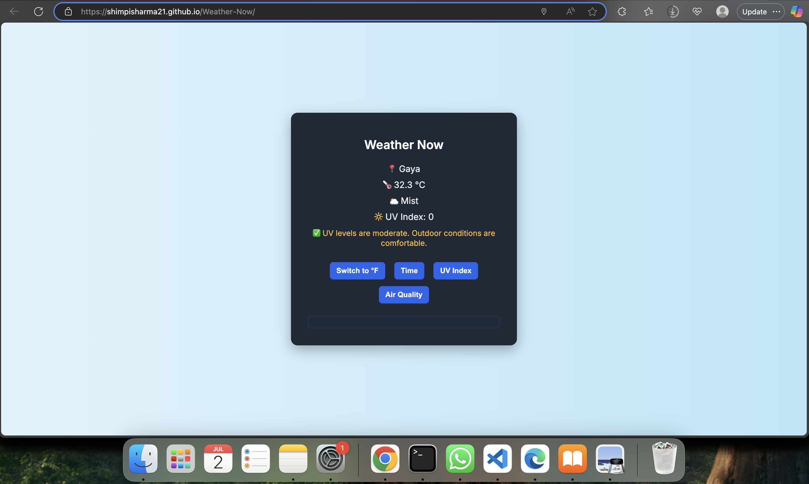

# 🌦️ Weather Now

Responsive weather app that shows live conditions including temperature, UV index, weather icons, and auto-location detection.

Built using HTML, CSS, JavaScript, and WeatherAPI. Deployed with GitHub Pages.

## 🔗 Live Preview

👉 [Click here to use the app](https://shimpisharma21.github.io/Weather-Now/)

## 🛠️ Tech Stack

- HTML5 & CSS3 for structure and design
- JavaScript for logic and API calls
- WeatherAPI for live data
- GitHub Pages for deployment

## 📦 Features

- 🌍 Auto-location weather based on user's city
- 🌡️ Temperature toggle between °C and °F
- 🌤️ Icon and weather description (e.g. Mist, Clear)
- 🔆 UV Index + health tips
- 📱 Responsive layout for all devices

## 📸 Screenshot

